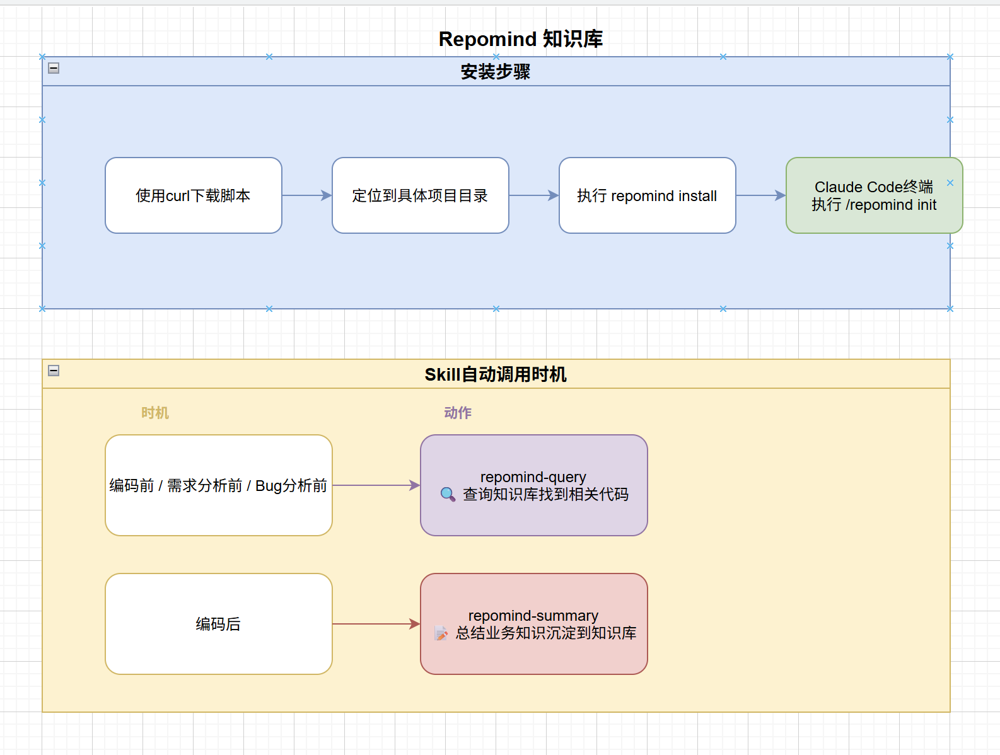

# RepoMind

为 Claude Code / Codex 编码助手提供业务代码知识库。AI 在修改代码前自动查询业务卡片和相关模块、理解上下文，编码后自动更新知识库，确保每次改动都有据可查。



## 安装

### 从源码构建

```bash
# 本地编译（静态链接，无 glibc 依赖）
make build

# 交叉编译所有平台
make build-all
```

### macOS / Linux

```bash
# 自动识别平台，安装到 /usr/local/bin 或 ~/.local/bin
curl -fsSL https://raw.githubusercontent.com/HobbyBear/repoMind/master/install.sh | bash
```

### Windows（PowerShell）

```powershell
# 一键安装——自动识别架构、安装到 ProgramData、配置系统 PATH
powershell -c "iwr -useb https://raw.githubusercontent.com/HobbyBear/repoMind/master/install.ps1 | iex"
```

如果以**管理员**身份运行，安装到 `C:\ProgramData\repomind\bin` 并配置系统 PATH；
普通用户则安装到 `%LOCALAPPDATA%\repomind\bin` 并配置用户 PATH。

### 初始化知识库

```bash
cd your-project
repomind install
```

`repomind install` 会自动完成：

- 创建 `.repomind/` 知识库目录（业务卡片 + 模块文档 + 排查记录 + 图谱缓存）
- 安装 Claude Code skill（`.claude/skills/repomind-*`）和 Codex skill（`.codex/skills/repomind-*`）
- 创建或全量刷新 `.claude/rules/repomind.md`，并只替换 `AGENTS.md` 中 repomind 自己管理的区块，不覆盖用户其他内容
- 配置 git hook（提交前自动增量更新图谱）
- 自动迁移旧知识文件格式，统一到每个文档自己的 `name` / `description` 元数据

## 使用

安装后无需手动操作，AI 编码助手自动执行：

- **编码前（概念问题）** — `repomind-query`：优先查 `.repomind/concepts/` 业务卡片
- **编码前（代码问题）** — `repomind-query`：先读取每个 knowledge 文档的 `name/description` 元数据 → 匹配业务模块 → 定位关键代码
- **回答 / 编码后** — `repomind-summary`：先执行轻量 summary gate；有新业务知识、用户纠错、变更影响或排查结论时，再更新业务卡片、模块文档、排查记录和元数据
- **随手沉淀** — 用户说“记一下 / 总结到知识库 / 以后遇到这个要注意”时，`repomind-summary` 会按类型写入 concepts、modules 或 troubles
- **PRD 处理** — `repomind-prd`：从需求文档提取业务概念，沉淀到知识库

首次在项目中安装后，知识库为空，需要初始化：

> 在 Claude Code 中执行 `/repomind-init`，在 Codex 中执行 `$repomind-init`

AI 会自动完成：运行 graphify 构建代码图谱 → 归纳业务概念与业务模块 → 创建业务卡片、模块文档和排查目录元数据。

## 命令

```bash
repomind install      # 初始化知识库
repomind uninstall    # 移除
repomind update       # 更新到最新版本
```

## 解决的问题

Graphify — 代码结构分析引擎

扫描源码 AST，提取文件间的依赖关系、调用链、社区聚类，生成 graphify-out/graph.json。它只回答一个问题："代码在技术上是怎样组织的？"

- 输入：源码目录
- 输出：节点图（文件、函数、imports、calls）+ 社区发现
- 纯 AST 提取，不调用 LLM

RepoMind — 业务知识库

在 Graphify 之上加了一层业务语义。把 graphify 的原始结构数据转化为 AI 编码助手能直接消费的业务文档。它回答："这个概念是什么？这个模块是干什么的？改它要注意什么？"

- 输入：graphify 的图谱 + 开发者对业务的理解
- 输出：
  - `.repomind/concepts/*.md`（业务卡片：定义、目的、边界、混淆点）
  - `.repomind/modules/*.md`（模块文档：关键代码、修改场景、注意事项）
  - `.repomind/troubles/*.md`（排查记录：现象、判断顺序、根因、验证方式）
  - 每个文档 frontmatter 的 `name` / `description`（动态路由元数据）

### Graphify vs RepoMind

| 维度 | Graphify | RepoMind |
|------|----------|----------|
| 定位 | 代码结构分析引擎 | 业务知识库 |
| 输入 | 源码目录 | Graphify 图谱 + 开发者业务理解 |
| 输出 | graphify-out/graph.json（节点图 + 社区发现） | .repomind/concepts/*.md + .repomind/modules/*.md + .repomind/troubles/*.md + 每文件元数据 |
| 回答的问题 | 代码在技术上是怎样组织的？ | 这个概念是什么？这个模块是干什么的？改它要注意什么？ |
| 更新方式 | graphify CLI 手动运行 | AI skill 编码前后自动更新 |
| 类比 | 建筑的结构图纸（承重墙在哪、管道怎么走） | 房间功能说明（这是厨房、插座在这里、注意地面防水） |

### 为什么两个都要

Graphify 只解决了"代码长什么样"，但 AI 改代码前需要知道的是两层信息：一层是“这个业务概念到底是什么、为什么存在”；另一层是“这笔退款逻辑在哪个模块里、改的时候会影响什么”。这些业务知识是 AST 提取不出来的，需要 RepoMind 来沉淀。RepoMind 现在不依赖中央索引文件，而是让每个知识文档自己提供 `name` / `description` 元数据，像 skill 元数据一样先做首轮路由，再按需打开正文，减少噪音并便于格式长期演进。

