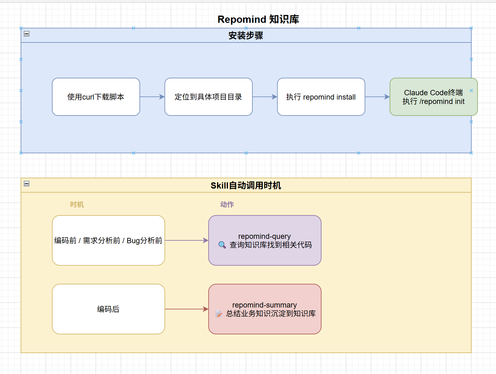

# RepoMind

为 Claude Code / Codex 编码助手提供业务代码知识库。AI 在修改代码前自动查询业务卡片和相关模块、理解上下文，编码后自动更新知识库，确保每次改动都有据可查。



## 核心特性

- **零手动** — 安装后 AI 自动在编码前后查询和更新知识库，开发者无需记忆任何命令
- **元数据路由** — 每个知识文档自带 `name`/`description` frontmatter，先匹配摘要再按需打开正文，避免中央索引的耦合和噪音
- **多维知识** — 业务卡片（concepts）定义"是什么"、模块文档（modules）定位"在哪改"、排查记录（troubles）沉淀"为什么出错"
- **Git 自动同步** — 提交前增量更新图谱，知识库始终与代码状态一致
- **智能 Gate** — 编码后先做轻量判断，有实质变更才写入，防止碎片知识污染
- **PRD 提取** — 从需求文档自动提取业务概念，需求阶段即可沉淀知识
- **格式自迁移** — 兼容旧版知识文件，安装时自动升级到最新元数据格式

## 安装

### 从源码构建

```bash
make build      # 本地编译（静态链接，无 glibc 依赖）
make build-all  # 交叉编译所有平台
```

### macOS / Linux

```bash
curl -fsSL https://raw.githubusercontent.com/HobbyBear/repoMind/master/install.sh | bash
```

自动识别平台，安装到 `/usr/local/bin` 或 `~/.local/bin`。

### Windows（PowerShell）

```powershell
powershell -c "iwr -useb https://raw.githubusercontent.com/HobbyBear/repoMind/master/install.ps1 | iex"
```

管理员运行安装到 `C:\ProgramData\repomind\bin`（系统 PATH），普通用户安装到 `%LOCALAPPDATA%\repomind\bin`（用户 PATH）。

### 初始化知识库

```bash
cd your-project
repomind install
```

自动完成：创建知识库目录 → 安装 Claude Code / Codex skill → 配置 AI 规则与 git hook → 迁移旧格式。

## 使用

安装后无需手动操作，AI 自动执行：

- **编码前** — `repomind-query`：通过元数据匹配业务模块、定位关键代码
- **编码后** — `repomind-summary`：智能判断是否有新知识需沉淀，按需更新
- **随手记** — 用户说"记一下 / 总结到知识库"，自动分类写入 concepts / modules / troubles
- **PRD 处理** — `repomind-prd`：从需求文档提取业务概念

首次安装后知识库为空，在 Claude Code 中执行 `/repomind-init`（Codex 中 `$repomind-init`），AI 会自动运行 graphify 构建图谱并初始化业务卡片。

## 命令

```bash
repomind install      # 初始化知识库
repomind uninstall    # 移除
repomind update       # 更新到最新版本
```

## 与Graphify及类似的知识库的区别

[Graphify](https://github.com/HobbyBear/graphify) 是代码结构分析引擎——扫描 AST 生成依赖图和社区聚类，回答**"代码在技术上怎样组织"**。纯静态分析，不涉及业务语义。

RepoMind 在 Graphify 之上叠加业务语义层，将技术图谱转化为 AI 可消费的业务文档，回答**"这个概念是什么、这个模块干什么、改它注意什么"**。

> 类比：Graphify 是建筑结构图（承重墙在哪、管道怎么走），RepoMind 是房间功能卡（这是厨房、插座位置、注意防水）。

两者互补：AST 提取不出业务语义，而 AI 改代码需要同时知道业务含义和代码位置——前者靠 RepoMind 沉淀，后者靠 Graphify 定位。
